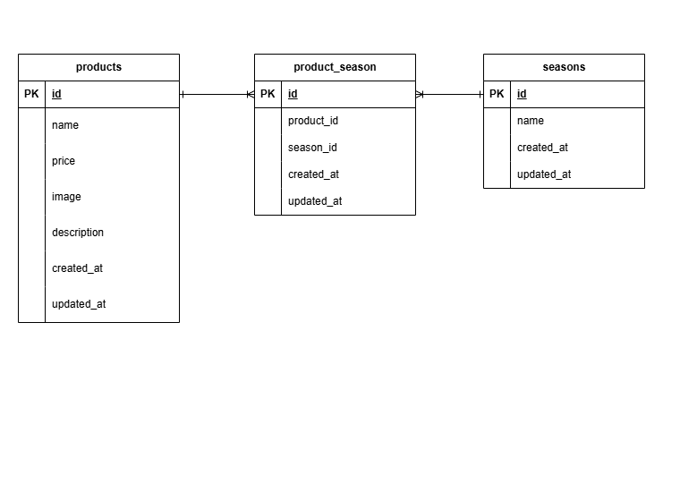

# もぎたて

## 環境構築
### Dockerビルド
1.git clone  
2.docker-compose up -d --build  

*MySQLは、OSによって起動しない場合があるのでそれぞれのPCに合わせて docker-compose.yml ファイルを編集してください。  

### Laravel環境構築
1.docker-compose exec php bash  
2.composer install  
3..env.exampleファイルから.envを作成し、環境変数を変更
  DB_CONNECTION=mysql  
  DB_HOST=mysql  
  DB_PORT=3306  
  DB_DATABASE=laravel_db  
  DB_USERNAME=laravel_user  
  DB_PASSWORD=laravel_pass  
4.php artisan key:generate  
5.php artisan migrate  
6.php artisan db:seed  
7.php artisan storage:link  

## 使用技術(実行環境)
- PHP 8.1.33
- Laravel 8.83.29
- MySQL 15.1
- Docker 28.0.1
- Docker Compose v2.33.1

## ER図

## URL
- 開発環境：http://localhost/
- phpMyAdmin:http://localhost:8080/